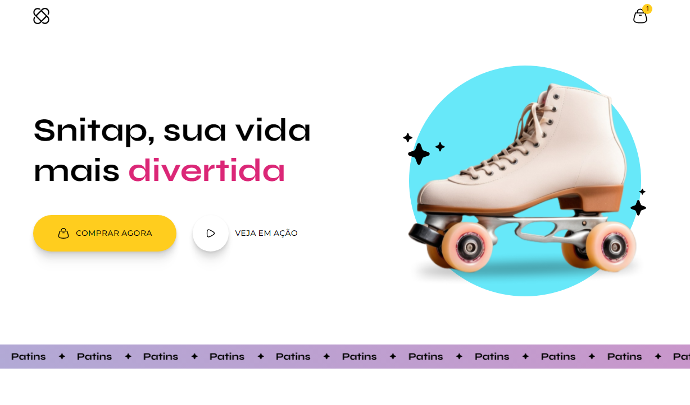

 

    

## 💻 Projeto
Esse é um projeto Web responsivo animado de uma página de patinação. Utilizando HTML e CSS. Feito com o objetivo de aprender sobre transições e animações em CSS. 

## 👩‍💻 Tecnologias
Esse projeto foi desenvolvido usando as seguintes tecnologias:

- HTML
- CSS
- GIT E Github

## 🏷️ Layout
Você pode visualizar o layout do projeto através [desse link](https://www.figma.com/community/file/1379866810042169871). É necessário ter uma conta no [Figma](https://www.figma.com).